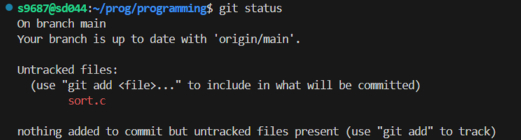
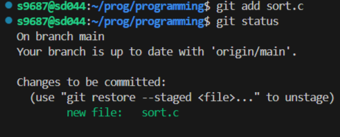
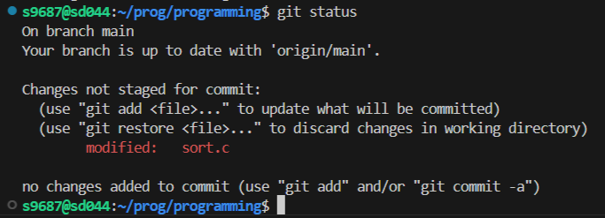
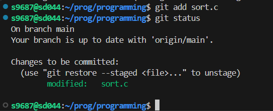
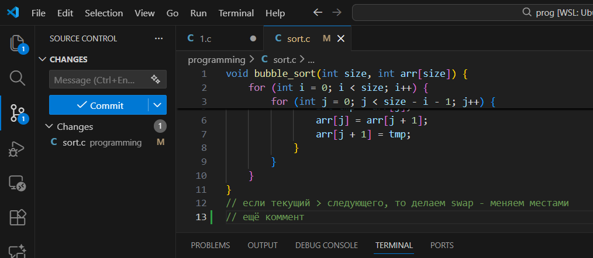
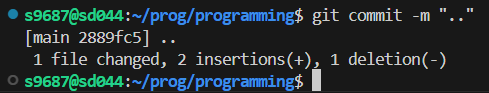
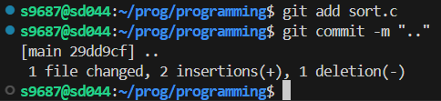
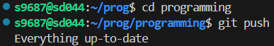
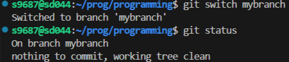

# programming
## на 3
1) Используем git status, чтобы узнать, на какой ветке мы находимся.

2) Как выглядит git log:

3) Создадим файл sort.c и вставим туда код функции сортировки:

4) Сейчас вывод git status выглядит так:

5) Добавим файл в область stage (add) 
6) Сейчас вывод git status выглядит так:

7) Закоммитим файл в репозиторий.
8) Сейчас вывод git status выглядит так:

9) Добавим комментарий с любым текстом в этот же файл

10)  Сейчас вывод git status выглядит так:

11)  Добавим (add) изменение файла 
12)  Сейчас вывод git status выглядит так:

13)  Изменим файл еще раз (добавим еще комментарий)

14)  Сделаем коммит

 

15)  Сейчас вывод git status и журнал (log) выглядят так:

 

16)  Добавим в stage и закоммитим последнее изменение

17)  Запушим на удаленный репо (git push)

### Работа с ветками

1. Используем git branch mybranch, чтобы создать новую ветку с именем mybranch.
2. Снова используем git branch, чтобы увидеть новую созданную ветку: 

3. Используем git switch mybranch (можно было и git checkout mybranch), чтобы переключиться на новую ветку:

4. Изменение вывода git status при переключении между master и новой веткой:

5. Убеждаемся, что мы находимся на своей ветке mybranch, прежде чем продолжить.

6. Создадим файл с именем file1.txt и своим именем. 
7. Добавим файл и закоммитьте это изменение.

8. Использовав git log --oneline --graph, видим, что наша ветка указывает на новый коммит.

9. Вернемся к ветке с именем master.
10. Используем git log --oneline --graph 
11. Создадим новый файл с именем file2.txt и закоммитим его. 
12. Используем git log --oneline --graph --all, чтобы увидеть, что наша ветка указывает на новый коммит, и что теперь у двух веток разные коммиты.

 

13. Переключимся на ветку mybranch. 
14. видим, что file2.txt пропал
15. Используем git diff mybranch main, чтобы увидеть разницу между двумя ветками

16. Закоммитим и запушим на удаленный репо ветку mybranch (git push -u origin mybranch)

17.  Убедимся, что в github.com две ветки master и mybranch, не забыв запушить изменения master ветки в master

## на 4

1. Переключимся на ветку mybranch. В ней находится файл sort.c из 
предыдущих шагов с функцией сортировки 
2. Перезапишим содержимое в sort.c, добавив функцию main(), в которой 
будет объявлен массив из нескольких чисел (int array[]={...}) и 
вызвана функция сортировки для этого массива: 

3. git diff вывел: 

4. diff --staged? Пустой?

5. Добавим в staged файл sort.c
6. git diff вывел: 
7. git diff --staged вывел:

8. Удалим одно число в массиве в sort.c: 
9. git diff вывел: 
10. git diff --staged вывел:

11. Объясните, что происходит 

12. Запустим git status и обратим внимание, что sort.c присутствует дважды 
в выводе:

13. Запустим git restore --staged sort.c, чтобы отменить индексацию 
изменения 
14. вывод git status выглядит так:

15. Индексируем изменение (add) и сделайте коммит:

16. журнал выглядит так: 

17. Добавим в sort.c в main() printf(“hello git\n”);. 
18. содержимое sort.c:

19. вывод git status выглядит так

20. Запустите git restore sort.c 
21. содержимое sort.c:

22. вывод git status выглядит так

23. Запушим на удаленный репо ветку.

## ветки и ff-merge

1. Создим файл greeting.txt, проиндексировав его и закоммитив с 
сообщением “Add file greeting.txt”. 
2. Добавим в этот файл слово hello, индексируем и коммитим с текстом 
"Add content to greeting.txt" :

3. Создаим ветку с именем feature/uppercase.
4. Переключимся на эту ветку 
5. вывод git status выглядит так 

6. Отредактируем greeting.txt, чтобы он содержал приветствие в верхнем регистре (HELLO) 
7. Добавим файл greeting.txt и закоммитим
8. вывод git branch:

9. вывод git log --oneline --graph –all: 

10. Переключимся на главную ветку 
11. Используем cat, чтобы увидеть содержимое файла greetings.txt 
12. Сравним ветки(diff)

13. Объединим ветки:

14. Используем cat, чтобы увидеть содержимое файла greetings.txt 
15. Удалим ветку с заглавными буквами (feature/uppercase)

16. Смержим ветку mybranch в master (git merge) 

17. вывод git log --oneline --graph –all: 

18. Запушим изменения ветки master на удаленный репо.

