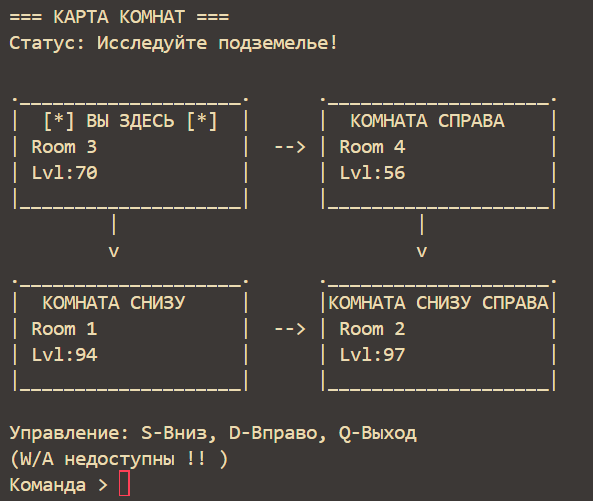

# 💻 Практическое задание 3. Списки

## 📄 singly.c
была созданна структура узла note_t, состоящая из поля структуры room и казателя на следующий узел next.

#### Структура данных комнаты (room):
```c
struct room {
    char name[50];    // Имя комнаты
    int level;        // Уровень сложности
    int number;       // Номер комнаты
    int resolution;   // Размер (разрешение) комнаты
};
```
## 📄 doubly.c
в node_t добавлено поле с указателем down на структуру node_t, для реализации двусвязного списка.

Была реализованна функция для связывания двусвязного списка с учетом того, что длинна верхнего и нижнего списка могут отличатся.

Был добавлен интерфейс с вводом с клавиатуры кнопок WASD для прохода по списку:


