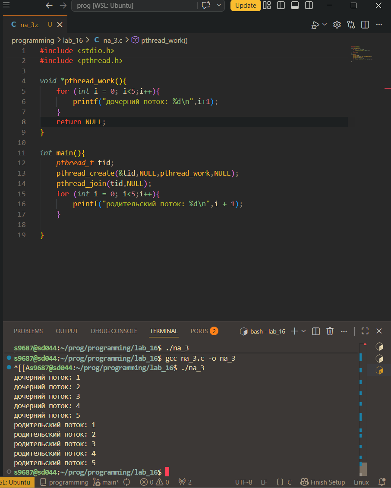
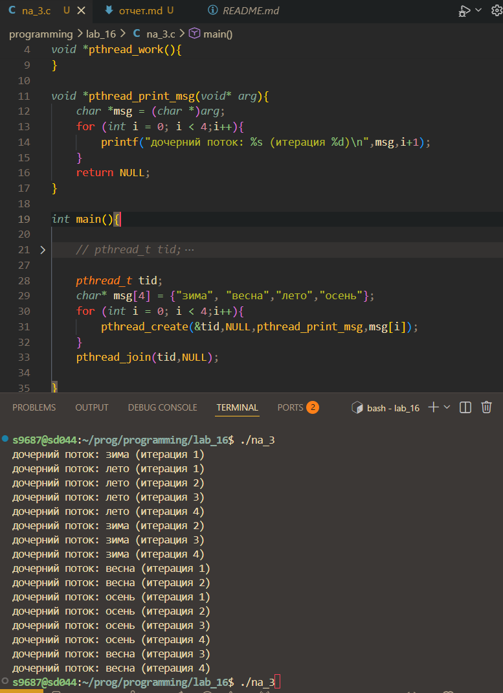
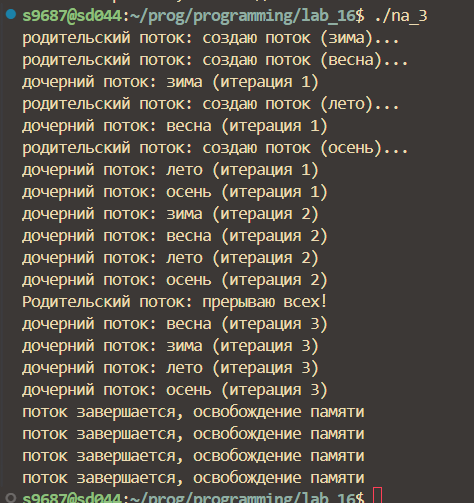
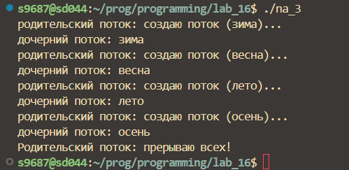

# 💻 Отчет по практическоему заданию 6.  Знакомство с POSIX потоками

## задание на 3

1. Создать поток 
```c
pthread_t tid;
pthread_create(&tid,NULL,pthread_work,NULL);
```
2. Ожидание потока
```c
pthread_join(tid,NULL);
```



3. Параметры потока

основной поток создает 4 потока,
исполняющих одну и ту же функцию.

```c
void *pthread_print_msg(void* arg){
    char *msg = (char *)arg;
    for (int i = 0; i < 4;i++){
        printf("дочерний поток: %s (итерация %d)\n",msg,i+1);
    }
    return NULL;
}
```



4. Завершение нити без ожидания

Спустя две секунды после создания дочерних потоков
основной поток прервает работу всех дочерних потоков с
помощью pthread_cancel().

```c
pthread_t tid[4];
char* msg[4] = {"зима", "весна","лето","осень"};
for (int i = 0; i < 4;i++){
    printf("родительский поток: создаю поток (%s)...\n",msg[i]);
    pthread_create(&tid[i],NULL,pthread_print_msg,msg[i]);    
}
sleep(2);
printf("Родительский поток: прерываю всех!\n");
for (int i = 0; i < 4; i++) {
    pthread_cancel(tid[i]);
    pthread_join(tid[i], NULL);
}
```
5. Обработать завершение потока

Дочерний поток перед завершение
распечатывал сообщение об этом. Используется
pthread_cleanup_push()

```c
void cleanup_handler(void *arg) {
    printf("поток завершается, освобождение памяти\n");
}
```

```c
void *pthread_print_msg(void* arg){
    char *msg = (char *)arg;
    pthread_cleanup_push(cleanup_handler, NULL);
    for (int i = 0; i < 4;i++){
        printf("дочерний поток: %s (итерация %d)\n",msg,i+1);
        sleep(1);
    }
    pthread_cleanup_pop(0);
    return NULL;
}
```



6. Реализация простой Sleepsor

```c
void*sleepsort(void* arg){
    int value = *(int*)arg;

    sleep(value);

    printf("%d\n",value);
    fflush(stdout);return NULL;
}

int main() {
    int n = 10;
    int arr[n];
    for (int i = n; i > 0;i--){
        arr[i-1]=i;
    }
    pthread_t tids[n];

    printf("Начинаем сортировку ...\n");

    for (int i = 0; i < n; i++) {
        pthread_create(&tids[i], NULL, sleepsort, &arr[i]);
    }
    for (int i = 0; i < n; i++) {
        pthread_join(tids[i], NULL);
    }
}
```

## задание на 4

7. Синхронизированный вывод

```c
void *pthread_print_msg(void* arg){
    char *msg = (char *)arg;
    pthread_mutex_lock(&mutex_ch);
    printf("дочерний поток: %s \n",msg);
    sleep(1);
    pthread_mutex_unlock(&mutex_parent);
    return NULL;
}
int main(){
     pthread_t tid[4];
    char* msg[4] = {"зима", "весна","лето","осень"};
    for (int i = 0; i < 4;i++){
        pthread_mutex_lock(&mutex_parent);
        printf("родительский поток: создаю поток (%s)...\n",msg[i]);
        pthread_create(&tid[i],NULL,pthread_print_msg,msg[i]);
        pthread_mutex_unlock(&mutex_ch);    
    }
    sleep(2);
    printf("Родительский поток: прерываю всех!\n");
    for (int i = 0; i < 4; i++) {
        pthread_mutex_unlock(&mutex_ch); 
        pthread_cancel(tid[i]);
        pthread_join(tid[i], NULL);
    }
}
```

